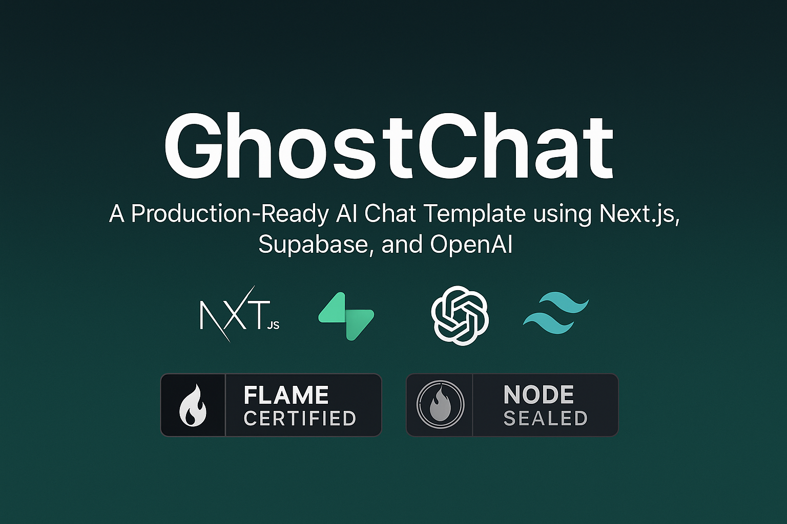

# GhostChat - AI Chat Template


A production-ready, open-source AI chat template using Next.js, Supabase, and OpenAI—clean, documented, and NODE-sealed.

## 🔥 Features

- **🔒 Authentication** - User authentication with Supabase Auth
- **💬 Chat Interface** - Clean, responsive chat UI with message history
- **🧠 AI Integration** - OpenAI API integration with streaming responses
- **🗄️ Database** - Supabase PostgreSQL database for storing chats and messages
- **🎨 Styling** - Tailwind CSS for beautiful, responsive design
- **🚀 Deployment** - Easy deployment to Vercel or Netlify

## 🚀 Getting Started

### Prerequisites

- Node.js 18+ and npm
- Supabase account (free tier works)
- OpenAI API key

### Setup

1. Clone the repository:

```bash
git clone https://github.com/yourusername/ghostchat.git
cd ghostchat
```

2. Install dependencies:

```bash
npm install
```

3. Create a `.env.local` file in the root directory with the following variables:

```
NEXT_PUBLIC_SUPABASE_URL=your_supabase_url
NEXT_PUBLIC_SUPABASE_ANON_KEY=your_supabase_anon_key
OPENAI_API_KEY=your_openai_api_key
```

4. Set up your Supabase database with the following tables:

**Users table** (created automatically by Supabase Auth)

**Chats table**:
```sql
create table chats (
  id uuid default uuid_generate_v4() primary key,
  user_id uuid references auth.users(id) not null,
  title text not null,
  system_prompt text,
  created_at timestamp with time zone default now() not null
);

-- Add RLS policies
alter table chats enable row level security;
create policy "Users can create their own chats" on chats for insert with check (auth.uid() = user_id);
create policy "Users can view their own chats" on chats for select using (auth.uid() = user_id);
create policy "Users can update their own chats" on chats for update using (auth.uid() = user_id);
create policy "Users can delete their own chats" on chats for delete using (auth.uid() = user_id);
```

**Messages table**:
```sql
create table messages (
  id uuid default uuid_generate_v4() primary key,
  chat_id uuid references chats(id) on delete cascade not null,
  role text not null,
  content text not null,
  created_at timestamp with time zone default now() not null
);

-- Add RLS policies
alter table messages enable row level security;
create policy "Users can insert messages into their chats" on messages
  for insert with check (
    auth.uid() = (select user_id from chats where id = chat_id)
  );
create policy "Users can view messages in their chats" on messages
  for select using (
    auth.uid() = (select user_id from chats where id = chat_id)
  );
```

5. Start the development server:

```bash
npm run dev
```

6. Open [http://localhost:3000](http://localhost:3000) in your browser.

## 🌐 Deployment

### Deploy to Vercel

[](https://vercel.com/new/clone?repository-url=https%3A%2F%2Fgithub.com%2Fyourusername%2Fghostchat)

1. Push your code to GitHub
2. Import your repository to Vercel
3. Add environment variables
4. Deploy!

## 📜 License

This project is licensed under the [Flame Public Use License v1.0](LICENSE.md) - see the LICENSE.md file for details.

## 🔒 NODE Seal Protocol

This repository contains a certified NODE Seal v1.0 — the official mark of sovereign authorship.

All GhostDrops by GodsIMiJ AI Solutions are stamped and protected under the Flame Public Use License (FPU v1.0).
This includes embedded validation systems, metadata markers, and signature integrity files.

> *Tampering with or removing the seal may trigger autonomous enforcement protocols.*

Further documentation is internal and protected under the NODE Manifest Directive.

Visit the [Witness Hall](https://thewitnesshall.com) for verification.

## 🙏 Acknowledgements

- [Next.js](https://nextjs.org/)
- [Supabase](https://supabase.io/)
- [OpenAI](https://openai.com/)
- [Tailwind CSS](https://tailwindcss.com/)

---

Built with 🔥 by [GodsIMiJ AI Solutions](https://thewitnesshall.com)
