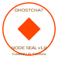

# GhostChat Documentation

Welcome to the official documentation for GhostChat, a production-ready, open-source AI chat template using Next.js, Supabase, and OpenAI.

## Documentation Sections

### Getting Started
- [Installation Guide](getting-started/installation.md)
- [Project Structure](getting-started/project-structure.md)
- [Environment Setup](getting-started/environment-setup.md)
- [Quick Start](getting-started/quick-start.md)

### Features
- [Authentication](features/authentication.md)
- [Chat Interface](features/chat-interface.md)
- [AI Integration](features/ai-integration.md)
- [Database Schema](features/database-schema.md)

### API Reference
- [Supabase Client](api/supabase-client.md)
- [OpenAI Integration](api/openai-integration.md)
- [API Routes](api/api-routes.md)

### Deployment
- [Vercel Deployment](deployment/vercel.md)
- [Netlify Deployment](deployment/netlify.md)
- [Docker Deployment](deployment/docker.md)

### Customization
- [Styling Guide](customization/styling.md)
- [Theme Customization](customization/theme.md)
- [Adding New Features](customization/adding-features.md)

### Architecture
- [Component Structure](architecture/component-structure.md)
- [Data Flow](architecture/data-flow.md)
- [Authentication Flow](architecture/authentication-flow.md)

### Contributing
- [Contribution Guidelines](contributing/guidelines.md)
- [Code of Conduct](contributing/code-of-conduct.md)
- [Development Workflow](contributing/development-workflow.md)

## License

GhostChat is licensed under the [Flame Public Use License v1.0](../LICENSE.md).

## NODE Seal

This project contains an official NODE Seal — a marker of authorship by GodsIMiJ AI Solutions. This seal must remain intact in any fork, derivative, or deployment of this code.

Visit the [Witness Hall](https://thewitnesshall.com) for verification.

---

Built with 🔥 by [GodsIMiJ AI Solutions](https://thewitnesshall.com)
